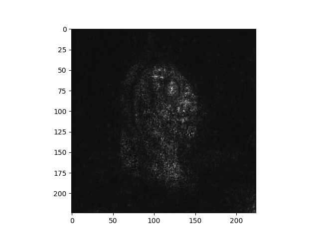
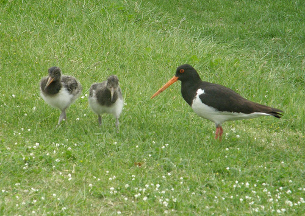
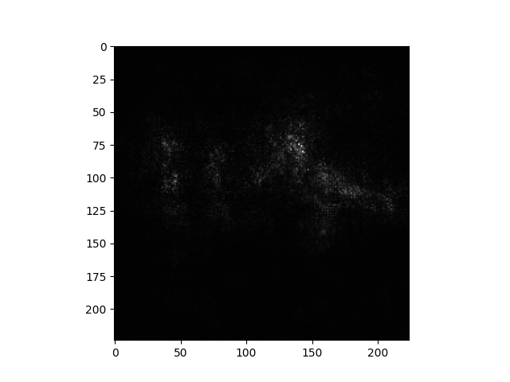

# Tensorflow Adversarial Gradient Integration

This repository is a tensorflow implementation of Adversarial Gradient Integration.

This method is a local explainer for a neural network. It aims at solving the two main issues of the Integrated Gradient method:

	- Choice of a suited baseline difficult
		- If you take a black image as a baseline, and try to explain an image of a panda, you will likely get only white parts of the panda as marked as important and black parts will be invisible.
		- This method automatically creates adversarial examples from your input image and use them as a baseline for the interpolation. Like that, we can see what are the important features that make a difference to discriminate the between the predicted class and the (many) adversarial classes.
	- Integration path
		- Integrated gradients use a straight path in the features space to interpolate between the baseline and the image to explain. This path is likely not a straight path in the latent space of the network, and therefore you can get information about other classes than the one you are interested in.
		- This method integrates along the path use to reach the adversaial example, so along a straight path in the latent space of the network, following the steepest ascent.

You will find more detailed information in the following paper: [Explaining Deep Neural Network Models with Adversarial Gradient Integration](https://doi.org/10.24963/ijcai.2021/396)

For this implementation, I use a combination of the paper and the [PyTorch implementation](https://github.com/pd90506/AGI).

---

You can find some examples below:

---

